<h1 align="center">Hi, I'm Redy Apriyadi 👋</h1>

  

### About me

- 🔭 Currently building **[TREFOZERI](https://redyapr.github.io/trefozeri/)** — a multi-timeframe Support/Resistance signal dashboard for XAUUSD & BTCUSD, with an automated Telegram alert pipeline and a fully public, verifiable track record.
- ⚙️ I like turning ideas into shipped, automated systems — CI/CD pipelines that fetch data, detect signals, and notify people without a human in the loop.
- 🌱 Into trading systems, market data pipelines, and clean developer tooling.
- 📫 Reach me at **redy.apriyadi@gmail.com** or on [LinkedIn](https://linkedin.com/in/redyapr).

### 📌 Featured project

 

**[TREFOZERI](https://redyapr.github.io/trefozeri/)** — live XAUUSD/BTCUSD S/R signal dashboard

### 📊 GitHub stats

  
  

